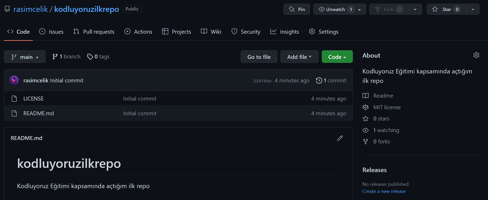

# Kodluyoruz İlk Repo

Bu repo Kodluyoruz Front End eğitiminde oluşturduğumuz ilk repo. İçerisinde bir adet README dosyası, bir adet index.html barındırmaktadır.

[patika.dev](https://www.patika.dev)

## Installation

Öncelikle projeyi clonelayın. ("https://github.com/rasimcelik/kodluyoruzilkrepo.git")

## Usage

Projeyi cloneladıktan sonra VS Code ile açınız.

Terminal:
`cd kodluyoruzilkrepo`
`code .`

## Contributing

Pull requestler kabul edilir. Büyük değişiklikler için, lütfen önce neyi değiştirmek istediğinizi tartışmak için bir konu açınız.

## License

[MIT](https://choosealicense.com/licenses/mit/)
